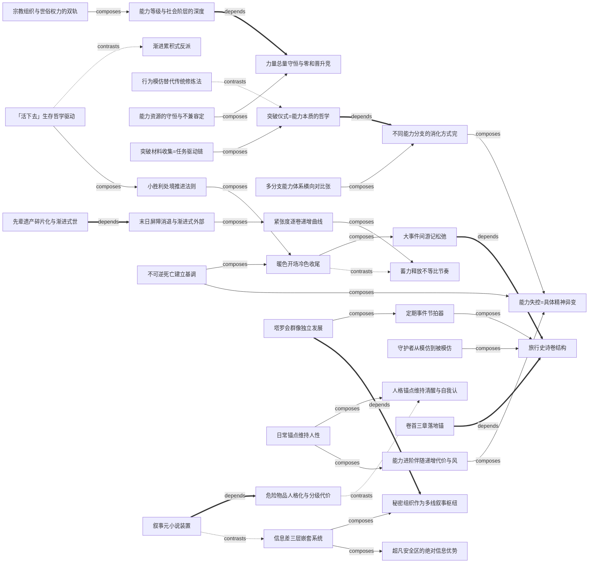

# 诡秘之主 — 借鉴模式地图

## 基本信息

- **作者**：爱潜水的乌贼
- **年份**：2018
- **一句话主旨**：克苏鲁式超凡体系下的"活下去"史诗——力量即代价，晋升即冒险，零和竞争驱动整个叙事张力。
- **蒸馏时间**：2026-06-12（v6.0 V1V2V3 通过）
- **borrowable 总数**：35（world: 6 / ability: 10 / characters: 7 / narrative: 3 / rhythm: 9）
- **高优模式（score≥4）**：28 条（其中 score=5 顶级：11 条）
- **关联覆盖率**：33/35（94%）的 borrowable 至少参与 1 条关系

## 按维度分组的 borrowable

### 世界观（world）（6 条）
- **危险物品人格化与分级代价体系** `world-危险物品人格化与分级代价体系` [★★★★] ⭐ — 危险物品具有独立人格和意志，不是简单的被动工具。物品按危险等级建立分级体系，每个物品有独特的使用规则、代价和反噬机制…
- **宗教组织与世俗权力的双轨司法体系** `world-宗教组织与世俗权力的双轨司法体系` [★★★★] ⭐ — 超凡者组织拥有对超凡力量的独立司法权，绕过世俗法律体系。不同超凡组织在同一城市按地理辖区分工，形成权力分配格局…
- **末日屏障消退与渐进式外部压力叙事** `world-末日屏障消退与渐进式外部压力叙事` [★★★★] ⭐ — 世界面临来自外部的终极威胁，威胁被远古屏障暂时隔绝但屏障正在消退。这种压力是渐进的、可观测的，不是突然降临…
- **超凡安全区的绝对信息优势叙事空间** `world-超凡安全区的绝对信息优势叙事空间` [★★★] — 超凡安全区提供不可侵犯的物理空间，用于储存危险品、组建秘密网络和进行远程沟通。核心价值是信息不对称…
- **先辈遗产碎片化与渐进式世界影响** `world-先辈遗产碎片化与渐进式世界影响` [★★] — 先辈在当前世界留下了物质和文化双重遗产，关键知识碎片化散布需要搜集，形成全书长线的搜集叙事…
- **力量总量守恒与零和晋升竞争** `world-力量总量守恒与零和晋升竞争` [★★★★★] 🔥高优 — 超凡力量本质是有限的、可转移的、守恒的资源。死亡后力量不消失而是转移给他人。同一路径最高阶位名额有限（仅一人），晋升=替换…

### 能力体系（ability）（10 条）
- **多分支能力体系横向对比张力** `ability-多分支能力体系横向对比张力` [★★★★] ⭐ — 多分支能力体系，每个分支有主题化命名和递进等级，分支间存在逻辑关联与横向对比…
- **能力失控=具体精神异变** `ability-能力失控=具体精神异变` [★★★★] ⭐ — 能力提升过程中存在失控风险，失控表现为具体的、可观测的精神异变症状（幻听、幻视、躁狂等），而非模糊的'走火入魔'…
- **不同能力分支的消化方式完全不同** `ability-不同能力分支的消化方式完全不同` [★★★★★] 🔥高优 — 能力体系中不同分支的熟练/消化方式完全不同，不是统一修炼法。每个分支的熟练方式与其能力主题深度绑定…
- **行为模仿替代传统修炼法** `ability-行为模仿替代传统修炼法` [★★★] — 用与能力主题相关的行为模仿来替代传统的打坐/修炼模式。角色必须'成为'能力的语义本身…
- **能力进阶伴随递增代价与风险** `ability-能力进阶伴随递增代价与风险` [★★★★] ⭐ — 能力每次进阶都伴随明确的代价和风险，且代价/风险随阶位递增。低阶可能只是资源消耗，高阶可能涉及人格消融…
- **突破仪式=能力本质的哲学实践** `ability-突破仪式=能力本质的哲学实践` [★★★★] ⭐ — 能力突破需要一个与能力主题深度绑定的仪式，将能力的核心哲学命题具象化为一个需要主动完成的行为/事件…
- **能力等级与社会阶层的深度耦合** `ability-能力等级与社会阶层的深度耦合` [★★★★★] 🔥高优 — 能力等级直接决定社会地位，能力者与非能力者之间、不同能力等级之间存在结构性阶级差异。形成'有钱更有能力'的正反馈循环…
- **人格锚点维持清醒与自我认同** `ability-人格锚点维持清醒与自我认同` [★★★★] ⭐ — 能力越强，越需要'锚点'——与人性、日常、情感绑定的参照物——来维持清醒和自我认同。失去锚点的角色更容易异化…
- **能力资源的守恒与不兼容定律** `ability-能力资源的守恒与不兼容定律` [★★★] — 能力资源总量守恒，一个个体拥有的高阶资源意味着另一个个体无法拥有。同类型资源之间存在排斥性（不兼容）…
- **突破材料收集=任务驱动链** `ability-突破材料收集=任务驱动链` [★★★★] ⭐ — 能力突破需要特定材料的收集，每种材料对应一次独立的任务/冒险/交易事件。材料收集过程自然驱动支线剧情…

### 人物（characters）（7 条）
- **「活下去」生存哲学驱动** `characters-「活下去」生存哲学驱动` [★★★★★] 🔥高优 — 主角以最低成本存活为第一优先，所有决策让位于生存。变强不是目标，而是被追杀不得不提升的副产品…
- **不可逆死亡建立基调** `characters-不可逆死亡建立基调` [★★★★★] 🔥高优 — 关键角色死亡为不可逆事件，不设复活、假死、替身等补救机制。死亡同时完成叙事功能：建立世界残酷基调并永久改变幸存者行为轨迹…
- **塔罗会群像独立发展** `characters-塔罗会群像独立发展` [★★★★] ⭐ — 核心配角各有独立目标、时间线和行动逻辑。角色间的信息交换基于互相需要而非主角施舍…
- **守护者从模仿到被模仿** `characters-守护者从模仿到被模仿` [★★★★] ⭐ — 角色从模仿前辈开始，经自身成长后成为被后来者模仿的对象，形成传承闭环。后代模仿的细节会有代际变异…
- **日常锚点维持人性** `characters-日常锚点维持人性` [★★★★] ⭐ — 角色在力量持续异化/膨胀的过程中，通过固定日常关系（家人/朋友/习惯）维持人性锚点…
- **渐进累积式反派** `characters-渐进累积式反派` [★★★★★] 🔥高优 — 反派以分身/代理人/暗线从故事早期即开始渗透主角周遭，每次正面揭示都比上次更强大。恐惧感来自'他一直在看'的持续性压迫…
- **灵魂寄生共生关系** `characters-灵魂寄生共生关系` [★★★] — 两个灵魂共享同一具身体，形成非对称共生关系。表面人格与寄生灵魂有独立性格/目标/语气，对身体的控制权持续博弈…

### 叙事（narrative）（3 条）
- **叙事元小说装置** `narrative-叙事元小说装置` [★★★] — 一件有独立意志的叙事道具脱离使用者控制后自行制造剧情事件，持有者误以为自己掌控全局，实则被道具反向驱动…
- **信息差三层嵌套系统** `narrative-信息差三层嵌套系统` [★★★★] ⭐ — 构建角色间信息不对称的三层结构：全知者>部分知情者>不知情者，每层各有独有盲区…
- **秘密组织作为多线叙事枢纽** `narrative-秘密组织作为多线叙事枢纽` [★★★] — 构建一个定期聚会的秘密组织，成员来自不同地域和阶层，互不知真实身份只以代号交流。组织成为多条故事线的制度化同步枢纽…

### 节奏（rhythm）（9 条）
- **作者反思驱动的节奏修复** `rhythm-作者反思驱动的节奏修复` [★★★★] ⭐ — 长篇连载中作者根据读者反馈和自我审视，在卷末/卷间总结节奏问题并做出结构性修正…
- **旅行史诗卷结构** `rhythm-旅行史诗卷结构` [★★★★★] 🔥高优 — 长篇多卷作品以主角空间移动为骨架组织卷级结构，每卷对应一个地理空间，空间转换触发卷级情绪切换…
- **卷首三章落地锚** `rhythm-卷首三章落地锚` [★★★★★] 🔥高优 — 多卷长篇中，每卷开头前三章通过三步完成叙事落地：新处境确立→新社交锚点建立→卷核心主题暗示…
- **定期事件节拍器** `rhythm-定期事件节拍器` [★★★★] ⭐ — 长篇连载中设置周期性固定事件（如组织集会/情报交换/市场采购）作为叙事节拍器…
- **大事件间游记松弛** `rhythm-大事件间游记松弛` [★★★★★] 🔥高优 — 高强度主线事件之间，主角前往新空间的游记式松弛段落。低压环境中展示新地域风土人情，同时埋设远期伏笔…
- **小胜利处境推进法则** `rhythm-小胜利处境推进法则` [★★★★★] 🔥高优 — 长篇升级体系中，主角的进步表现为处境改善而非纯粹战斗力提升。每次小胜利都是'资源/人脉/地位'的量变积累…
- **暖色开场冷色收尾** `rhythm-暖色开场冷色收尾` [★★★★★] 🔥高优 — 卷级情绪波浪设计：每卷以暖色基调开场（日常、安全、归属感），以冷色基调收尾（死亡、失败、不可逆损失）…
- **紧张度逐卷递增曲线** `rhythm-紧张度逐卷递增曲线` [★★★★] ⭐ — 多卷长篇的整体紧张度曲线设计：逐卷递增但不线性，中期卷可有回调（游记/喘息），峰值通常在倒数第二卷…
- **蓄力释放不等比节奏** `rhythm-蓄力释放不等比节奏` [★★★★] ⭐ — 卷级高潮采用不等比蓄力释放节奏：蓄力段远长于释放段，制造暗流汹涌的压迫感…

## 关系图（Mermaid）

> 实线 `-->` = composes-with（常一起用）｜虚线 `-.->` = contrasts-with（对立/取舍）｜粗箭 `==>` = depends-on（前置依赖）

## 关键组合（经典调用方案）

### 组合 1：公路文节奏三件套 🔥
**核心**：`rhythm-旅行史诗卷结构`（骨架）+ `rhythm-大事件间游记松弛`（暖色填充）+ `rhythm-卷首三章落地锚`（换卷落地）
- 旅行史诗卷结构是公路文的空间骨架
- 卷间游记段落（暖色弧）作为伏笔窗口
- 卷首三章消除换卷断裂感
- 适配「这次不一样」从北到南的春秋战国公路骨架

### 组合 2：暖冷情绪波浪 + 不可逆死亡 🔥
**核心**：`rhythm-暖色开场冷色收尾`（情绪骨架）+ `characters-不可逆死亡建立基调`（冷色实现）+ `rhythm-小胜利处境推进法则`（暖色填充）
- 暖色弧给真温暖，冷色弧兑现不可逆损失
- 死亡是冷色收尾的最强形式
- 小胜利在暖色弧内推进处境但不改变系统
- 直接适配「这次不一样」的情绪波浪铁律

### 组合 3：能力代价闭环 ⭐
**核心**：`ability-能力进阶伴随递增代价与风险` + `ability-能力失控=具体精神异变`（代价最高形式）+ `characters-日常锚点维持人性`（对冲）
- 每次进阶代价递增，失控是代价的天花板
- 日常/人性锚点是对冲异化的反向力量
- 与「这次不一样」以太六准则之"代价法则"深度契合

### 组合 4：力量守恒 + 阶层固化 🔥
**核心**：`world-力量总量守恒与零和晋升竞争`（守恒原则）+ `ability-能力等级与社会阶层的深度耦合`（阶层表达）+ `world-宗教组织与世俗权力的双轨司法体系`（制度实现）
- 守恒原则 → 席位唯一 → 阶层固化 → 双轨司法固化权力
- 适配「这次不一样」的春秋战国势力结构

### 组合 5：信息差叙事枢纽 ⭐
**核心**：`narrative-信息差三层嵌套系统` + `narrative-秘密组织作为多线叙事枢纽` + `characters-塔罗会群像独立发展`
- 三层信息差制造角色间持续张力
- 秘密组织作为多线同步的制度化枢纽
- 群像独立发展需要枢纽维持信息交换
- 适配公路文中主角途经各地时维持多线并行

## 关系统计

| 关系类型 | 数量 |
|---------|------|
| composes-with | 20 |
| contrasts-with | 5 |
| depends-on | 7 |
| **总计** | **32** |

合理范围：每 10 个 borrowable 约 8-15 条关系。当前 35 条 / 32 关系 = 每 10 条 9.1 关系。落在合理区间内（宁缺毋滥）。

## 检索入口

- L1 ctx_search: `ctx_search(queries=["诡秘之主 {需求}"], source="ref-distill-诡秘之主")`
- L2 vector: `search(action="vector", novel_name="_参考库", query_text="{需求}")`
- L3 keyword: `search(action="keyword", novel_name="_参考库", keyword="{关键词}", top_k=10)`
